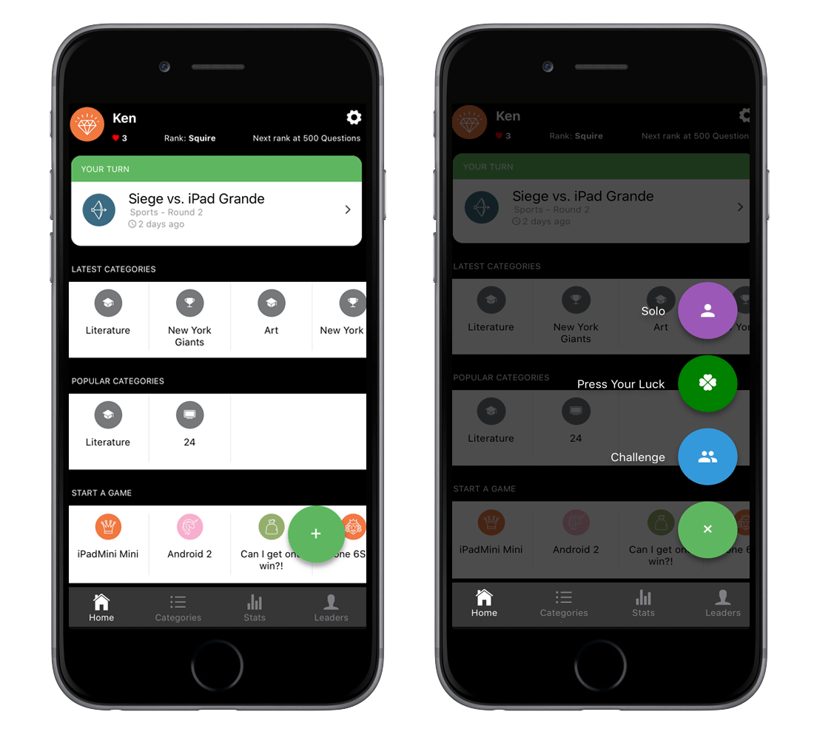
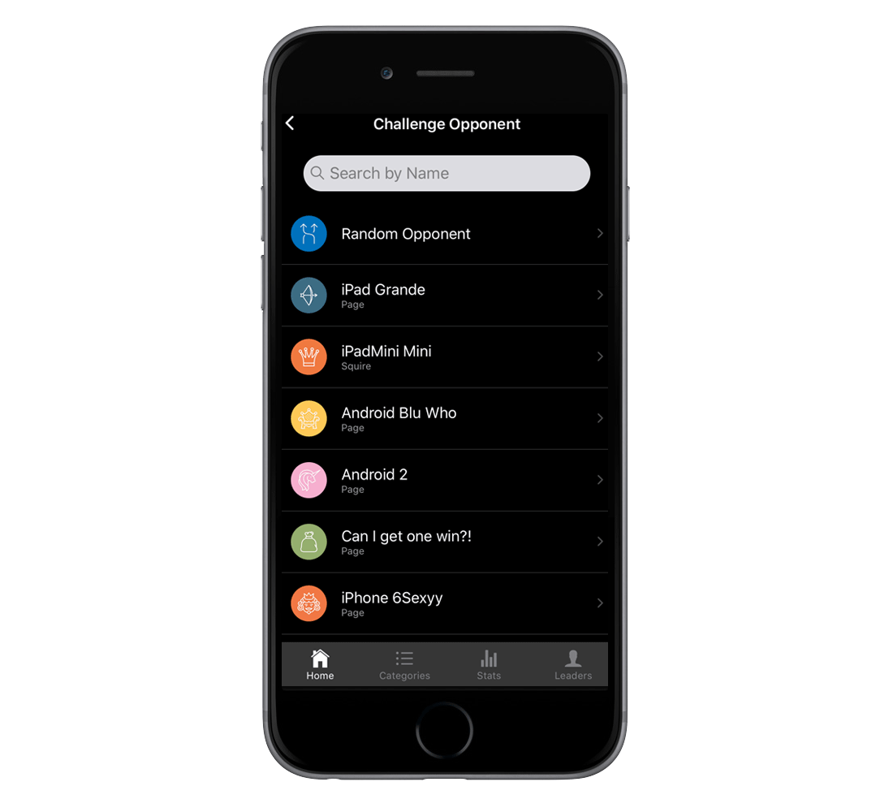
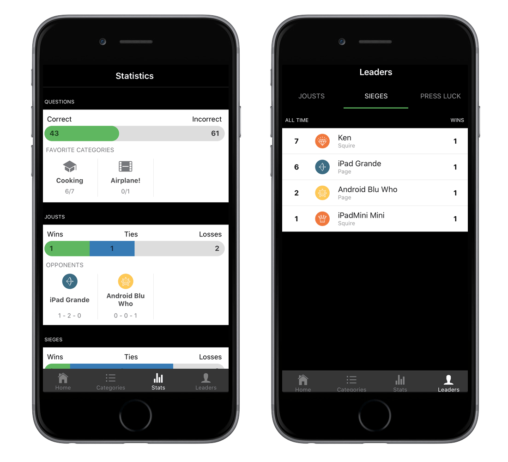

The home screen shows player rank, current games, and category information. There are four game modes.

Games can by started by selecting a game type then selecting from a list of players, or selecting a friend from the home screen and the selecting a game type.

Players can see their individual statistics for questions answered and games played, as well as their standings on the leaderboards.

